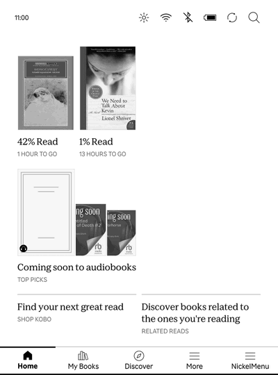

# Anna's Kobo

Search Anna's Archive and LibGen from your Kobo and download books straight
into the library. Everything runs on the device. No computer needed after
install.



Built and tested on a Kobo Clara BW, firmware 4.45. Written in Rust, ships
as one static binary of about 4 MB.

## Using it

1. Open NickelMenu and tap "Anna's Kobo". A pop-up with a search box opens.
2. Type a title or author, pick a format (EPUB by default), tap Search.
   Results take 5 to 10 seconds. The page refreshes itself.
3. Tap Download on a result. The Downloads page shows progress: finding a
   link, downloading, converting to kepub.
4. When it says done, the Kobo browser asks "File Download ... Continue".
   Tap Continue. The book appears in the library a few seconds later.
5. Close the pop-up. The book is on Home and in My Books.

Failed downloads have a Retry button. Mirrors fail now and then, and the app
already tries several before giving up. "Add to library again" makes a second
copy.

Settings (top bar): optional Anna's Archive membership key, fixed mirrors,
search source, delivery mode, kepub on or off. Without a membership key,
books come from LibGen's free servers.

## Install

### From a Mac

1. Download `AnnasKoboInstaller.zip` from the
   [latest release](https://github.com/tunctn/annas-kobo/releases/latest)
   and unzip it.
2. Plug the Kobo in over USB and tap Connect on its screen.
3. Open "Anna's Kobo Installer". It installs NickelMenu if the Kobo does not
   have it, installs or updates Anna's Kobo, and ejects the Kobo.
4. Unplug the Kobo and restart it (hold power, tap Power off, then turn it
   on). It shows an update screen for a few seconds. "Anna's Kobo" is now in
   NickelMenu.

The app has no Apple signature, so macOS refuses it the first time.
Right-click the app, choose Open, and confirm. On macOS 15 open System
Settings, Privacy & Security, and click Open Anyway.

The same installer runs from a terminal, with the same dialogs:

```sh
curl -fsSL https://raw.githubusercontent.com/tunctn/annas-kobo/main/tools/install-usb | sh
```

### By hand

Works from any computer. NickelMenu must already be on the Kobo; it installs
the same way.

1. Download `KoboRoot.tgz` from the
   [latest release](https://github.com/tunctn/annas-kobo/releases/latest).
2. Plug the Kobo in, tap Connect, and copy the file into the `.kobo` folder
   of the `KOBOeReader` drive.
3. Eject, unplug, and restart the Kobo.

This is the standard Kobo add-on format. At boot the firmware extracts the
package over `/`, which puts the app in `.adds/annas-kobo/` and one menu
file in `.adds/nm/`. Your own NickelMenu config is not touched. To update,
repeat the steps.

### Over Wi-Fi (development)

Enable ssh once: on the USB drive rename `.kobo/ssh-disabled` to
`.kobo/ssh-enabled`, eject, reboot. The first `ssh root@<kobo-ip>` asks you
to set a root password. Put your public key in `/.ssh/authorized_keys` on
the device.

```sh
tools/build     # cross-compile
tools/deploy    # copy the binary, launcher and menu file to the Kobo, restart the app
tools/package   # build dist/KoboRoot.tgz
tools/package-installer   # build dist/AnnasKoboInstaller.zip, the Mac app
```

`tools/deploy` reads `KOBO_HOST`, `KOBO_KEY` (ssh private key) and `MAC_IP`
from the environment.

Signing out of the Kobo account wipes `.kobo`, including the ssh marker and
the root password. Everything under `.adds` survives.

### Uninstall

Delete `.adds/annas-kobo/` and `.adds/nm/annas-kobo` over USB.

## How it works

- Search goes to Anna's Archive first. Its search pages sit behind a
  DDoS-Guard browser check that the app cannot pass. When that happens the
  app switches to LibGen for six hours and says so on the results page.
  LibGen serves the same files under the same md5 identifiers.
- Downloads use Anna's fast download API when you have a membership key.
  Otherwise, or if that fails, they go through LibGen's free download page.
  Anna's own slow downloads need a browser, a wait and a captcha, so the app
  does not use them.
- EPUBs are converted to KEPUB on the device with
  [kepub-rs](https://github.com/tiago-cos/kepub-rs), a Rust port of
  [kepubify](https://github.com/pgaskin/kepubify). It takes about 2 seconds
  per book on the Clara BW.
- Finished books wait in RAM under `/tmp/annas-kobo`. The Downloads page
  hands them to the Kobo browser as a file download, and Nickel imports the
  file the same way it imports Google Drive downloads. Books must not wait
  under `/mnt/onboard`, because Nickel scans every folder there and would
  import the waiting copy too.
- Folder mode (in Settings) saves to `/mnt/onboard/Books` instead. Nickel
  then needs a rescan, either through NickelDBus or a NickelMenu entry:
  `menu_item:main:Import books:nickel_misc:rescan_books`.
- Mirrors come from [open-slum.org](https://open-slum.org/), sorted by
  reported health, probed, and cached for 30 minutes. You can override them
  in Settings.
- Nickel never brings the loopback interface up, so the launcher runs
  `ifconfig lo up` first. Without it the pop-up never loads.

The UI is plain server-rendered HTML for the Kobo's old WebKit: big buttons,
black on white, meta-refresh for progress, no JavaScript.

## Files on the device

```
/mnt/onboard/.adds/annas-kobo/annas-kobo      the service (listens on 0.0.0.0:8484)
/mnt/onboard/.adds/annas-kobo/annas-kobo.sh   launcher
/mnt/onboard/.adds/annas-kobo/config.json     settings (also editable over USB)
/mnt/onboard/.adds/annas-kobo/annas-kobo.log  log
/tmp/annas-kobo/                              finished books waiting for the browser (RAM)
/mnt/onboard/Books/                           downloads in folder mode
```

From any machine on the same network, `http://<kobo-ip>:8484/log` shows the
app log and `http://<kobo-ip>:8484/syslog?n=500` shows Nickel's syslog.

## Command line

```
annas-kobo serve [--data-dir DIR] [--listen HOST:PORT]
annas-kobo search [--source auto|annas|libgen] [--ext epub] QUERY
annas-kobo download MD5
annas-kobo kepubify FILE...
annas-kobo mirrors
```

It also runs on a Mac: `cargo run -- serve`, then open
http://127.0.0.1:8484/.

## Development

```sh
brew install rustup zig && rustup toolchain install stable
rustup target add armv7-unknown-linux-musleabihf
cargo install cargo-zigbuild

cargo test                                  # parser tests
cargo run -- search --ext epub dune herbert
cargo run -- kepubify book.epub
tools/build && tools/deploy
echo 'tail -30 /mnt/onboard/.adds/annas-kobo/annas-kobo.log' | tools/kobo-sh
tools/kobo-shot shot.png                    # screenshot (needs koboterm on the device)
tools/kobo-gif                              # stop-motion GIF: Enter per frame, q to stitch docs/demo.gif
```

`tools/kobo-sh` feeds a script to the Kobo through the stock sshd's
interactive shell, since it supports no scp or sftp.

## Layout

| file | role |
|---|---|
| `src/main.rs` | CLI, logger |
| `src/web.rs`, `src/pages.rs` | HTTP server, background searches, HTML pages |
| `src/annas.rs` | Anna's Archive search parsing, challenge detection, fast download API |
| `src/libgen.rs` | LibGen search parsing and free download links |
| `src/slum.rs` | open-slum.org parsing, mirror probing, cache |
| `src/jobs.rs` | download queue, mirror walking, file naming, conversion, hand-off |
| `src/kepub.rs` | EPUB to KEPUB via kepub-rs |
| `src/nickel.rs` | Nickel detection, NickelDBus rescan for folder mode |
| `src/config.rs` | `config.json` |
| `kobo/` | launcher script and the NickelMenu file |
| `mac/` | Info.plist of the installer app |
| `tools/` | build, package, package-installer, deploy, install-usb, kobo-sh, kobo-shot |
| `.github/workflows/release.yml` | builds `KoboRoot.tgz` and the installer on a `v*` tag |

## License

GPL-3.0-or-later. Copyright (C) 2026 Tunç Türkmen. kepub-rs is MIT.
